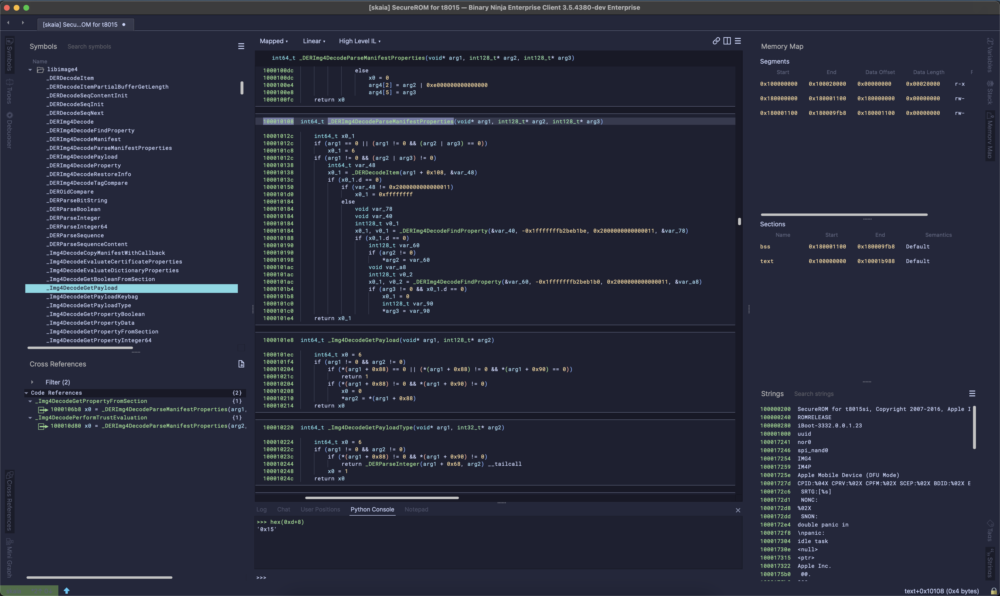
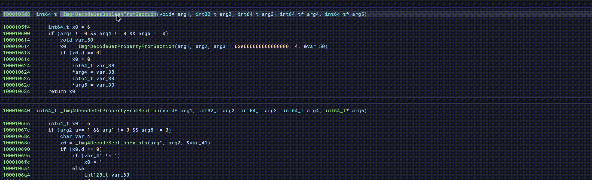
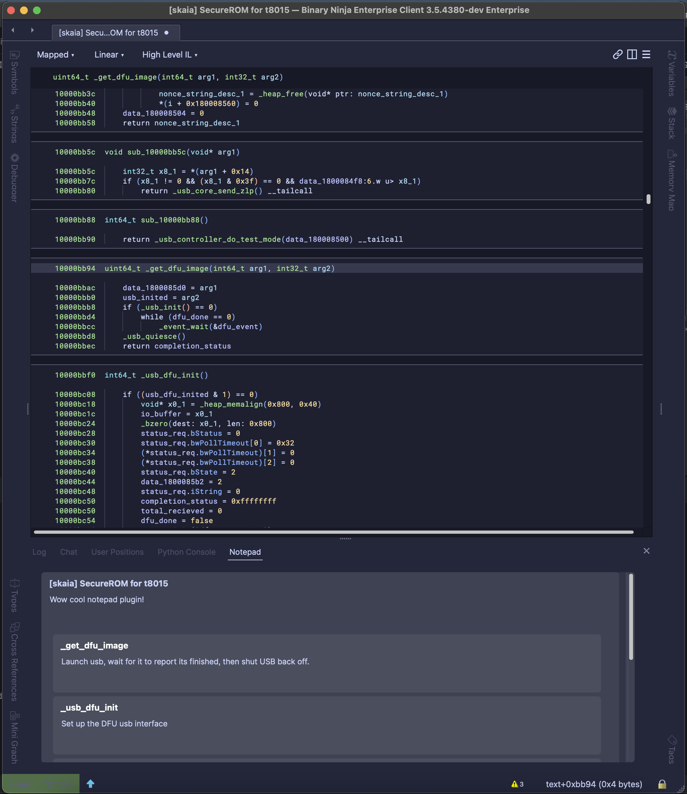
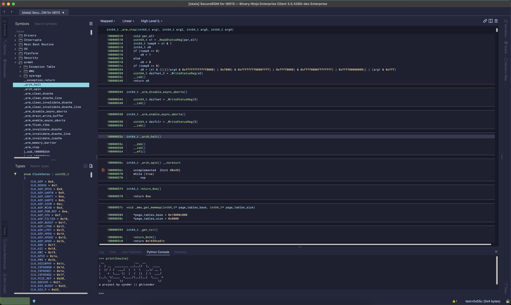
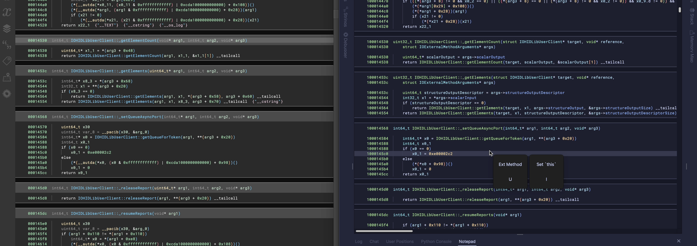

<p align="center">
 
</p>


<p align="center">
<a href="https://github.com/cxnder/ksuite#callgraph">Callgraph</a> | <a href="https://github.com/cxnder/ksuite#notepad">Notepad</a> | <a href="https://github.com/cxnder/ksuite#dockable-sidebars">Dockable Sidebars</a> | <a href="https://github.com/cxnder/ksuite#multishortcut">MultiShortcut</a> | <a href="https://github.com/cxnder/ksuite#type-helper">XNU Tools</a> | <a href="https://github.com/cxnder/ksuite#re-imagined-theme">Reimagined theme</a>
</p>

<p align="center">Not an official Vector 35 plugin. | This project is at ~75% completion. See the tracked issues for more info.</p>

<p align="center"><a href="https://github.com/cxnder/ksuite#building">Building & Installing</a></p>

## Dockable Sidebars

Drag your sidebar widgets where you need them, so you aren't constantly switching between widgets.

<p align="center">
 
</p>

Sidebars support all 4 positions (at the 4 corners of the screen,) and widgets
can be moved around.

## MultiShortcut



Hitting the key bound for the "KSuite" action (default K) (or running it via Command Palette) will
open a submenu with relevant bound actions triggerable by the keys surrounding "K".

This allows chaining easily rememberable keybinds to perform actions with granularity.
(e.g. `K U I U` will generate a downward callgraph from the current function, without psuedocode,
but `K U I I` will generate one with psuedocode). I have used this heavily, they quickly become
muscle memory.

## Callgraph

MultiShortcut: `k` -> `u`  
Menu: `Plugins` -> `Callgraph`

<p align="center">
 
</p>

Supports generating callgraphs with HLIL included or solely with names

Can generate a graph `N` calls into a func, out of a func, a variable amount in both directions, or of the entire program.

Runs entirely backgrounded and uses exclusively BinaryNinja APIs for a seamless and snappy integration into the product.
It's very fast :)

## Notepad

Notepad plugin for BinaryNinja, supporting function/address specific notes
combined into a global pad per-binary.

<p align="center">
 
</p>

## Re-Imagined Theme

<p align="center">
 
</p>

A custom layout has been designed from the ground up (using the color base from [catppuccin](https://github.com/catppuccin))
built for modernity and legibility.

`<note> The theme is subject to change fairly heavily before this project hits 100% completion </note>`


## Darwin Kernel Tooling 

<p align="center">
 
</p>

<p align="center"><i>Before and after in action on IOHIDFamily</i></p>

### Type Helper

MultiShortcut: `k` -> `i`  

This is a set of UIActions (also included in the Multishortcut menu) that assist with the typing of 
interesting methods in Kexts (particularly UserClient external methods for now).

### Darwin Kernel Workflow

Workflow ID: `core.function.darwinKernel`

This module workflow runs a few routines:
* Removes PAC from LLIL upward
* Consolidates certain SIMD code so it no longer takes up 16 HLIL lines per instruction
* Properly transforms jumps to unknown locations to tailcalls

## Building

Many of the more useful bits here have been submoduled out, and you can check a given submodule
for instructions on building + installing it as a standalone plugin, they all support it.

As this project isn't quite at a 1.0, (and due to some issues with Windows CI),
CI hasn't been added quite yet. This plugin has some very awesome tooling already,
however, and you can build it on your own machine w/ some effort

1. Download the appropriate Qt build for your OS https://github.com/Vector35/qt-artifacts/releases/latest
2. Extract it in your home folder; e.g. `cd ~; unzip qt6.4.3-macosx.zip`
3. 
```shell
# Git Setup Phase
git clone git@github.com:cxnder/ksuite.git
cd ksuite
git submodule update --init # Dont do recursive right now, there are some issues
cd binaryninja-api
git apply ../api.patch
cd ..
# Cmake phase
mkdir -p build && cd build
# For headless builds, omit -DUI_BUILD=ON argument entirely or set it to OFF
cmake -DCMAKE_BUILD_TYPE=Release -DUI_BUILD=ON -DXNU_BUILD=ON -DNOTEPAD_BUILD=ON -DCALLGRAPH_BUILD=ON ../
# Actually build it
cmake --build . --target=install -j 8 
```

These instructions are liable to change at any time pre-release

`-DUI_BUILD=ON` - Build things dependent on Qt  
`-DXNU_BUILD=ON` - Build the XNU toolkit  
`-DNOTEPAD_BUILD=ON` - Build the notepad tooling  
`-DCALLGRAPH_BUILD=ON` - Build the callgraph tooling
