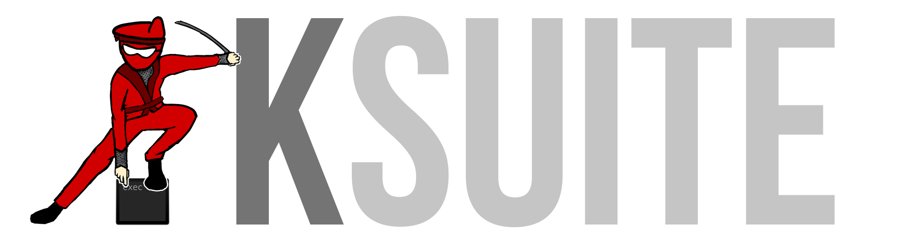

 

This is a modpack for BinaryNinja that implements some UI modifications and also adds support for a few file formats.

It is not officially associated or affiliated with Vector35 in any capacity.

## UI Modifications

This plugin makes some heavy modifications to layout and general design.

### Dockable Sidebars

Sidebars support all 4 positions (at the 4 corners of the screen,) and widgets
can be moved around.

When a sidebar item is drag-dropped anywhere but a sidebar, it'll open as a separate window and float on top :)

### MultiShortcut

Hitting the key bound for the "KSuite" action (default K) (or running it via Command Palette) will
open a submenu with relevant bound actions triggerable by the keys surrounding "K".

This allows chaining easily rememberable keybinds to perform actions with granularity.
(e.g. `K U I U` will generate a downward callgraph from the current function, without psuedocode,
but `K U I I` will generate one with psuedocode). I have used this heavily, they quickly become
muscle memory. 

## Darwin Kernel Tooling 

### Type Helper

This is a set of UIActions (also included in the Multishortcut menu) that assist with the typing of 
interesting methods in Kexts (particularly UserClient external methods for now).

### Darwin Kernel Workflow

This module workflow runs a few routines:
* Removes PAC from LLIL upward
* Consolidates certain SIMD code so it no longer takes up 16 HLIL lines per instruction
* Properly transforms jumps to unknown locations to tailcalls

## Binary Views

### SharedCache

Sketch for Shared Cache Support integrated as a native BinaryView. This is an early WIP and should basically be ignored for now.

